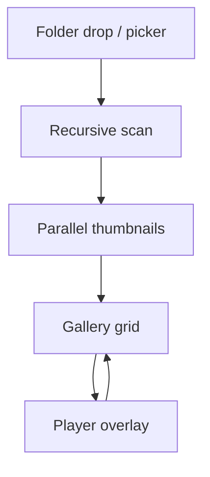
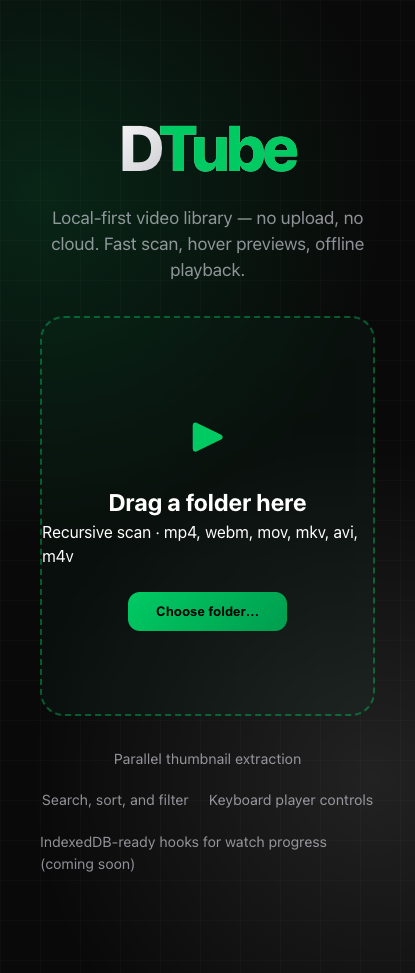

# DTube — Local Video Explorer

**One line:** Fast, offline video library — scan folders locally, preview on hover, search and sort, play with keyboard shortcuts. No upload, no cloud.

## Flow



## Demo

```bash
cd frontend
npm install
npm run dev
```

Open http://localhost:5173 → drag a folder or **Choose folder**.

## Features

- File System Access API + `<input webkitdirectory>` fallback
- **Parallel** thumbnail extraction (configurable concurrency)
- Search, sort, extension filter, grid density
- Hover preview for mp4/webm/mov
- Player: speed, zoom, volume, playlist prev/next, keyboard shortcuts
- Optional `server/` proxy for non-browser environments

## Keyboard shortcuts (player)

| Key | Action |
|-----|--------|
| Space | Play / pause |
| ← / → | Seek ±5s |
| Shift+← / → | Previous / next file |
| F | Fullscreen |
| Esc | Close player |

## Deploy

```bash
cd frontend && npm run build
# Deploy dist/ to GitHub Pages or Vercel
```

## Project structure

```
dtube-local-video/
├── frontend/     # Vite + React
└── server/       # Optional Node file server
```

## Screenshots



## Integrations (roadmap)

- IndexedDB watch progress and resume timestamps
- Sidecar `.json` metadata per folder
- Plugin hook: `window.DTube.registerFilter(fn)`

## Tech stack

Vite · React 19 · glassmorphism CSS · Canvas thumbnails

## License

MIT
